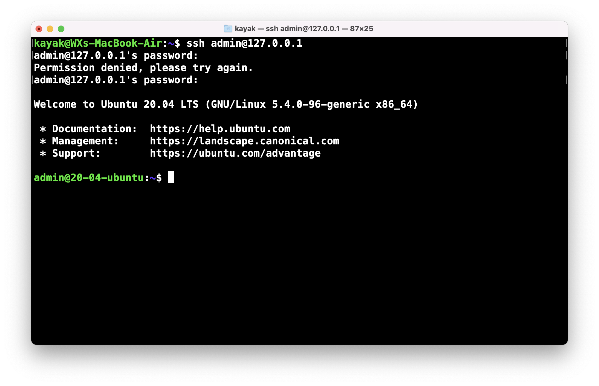
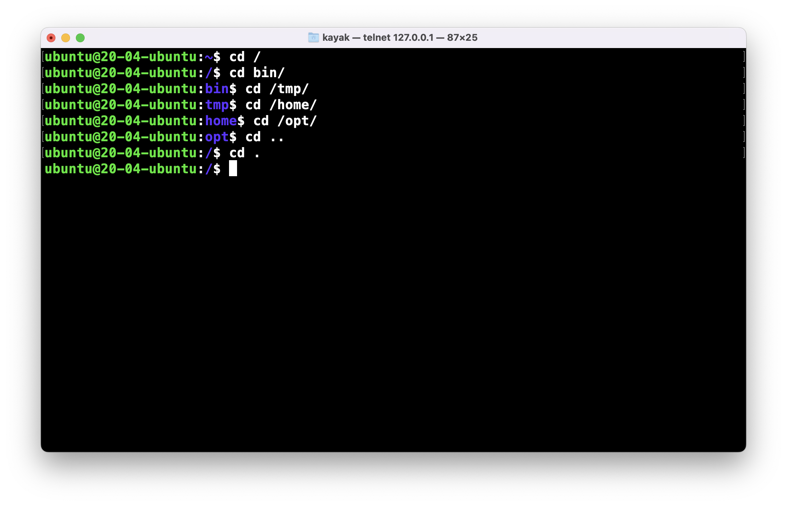
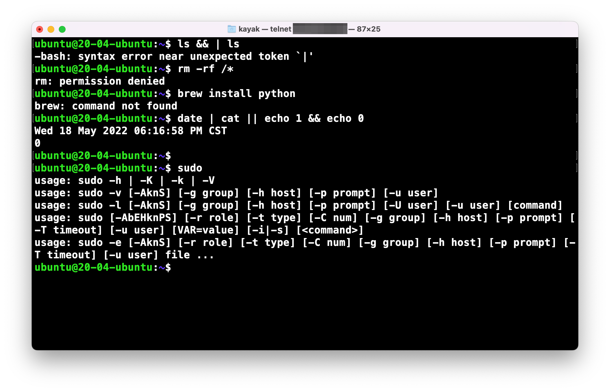
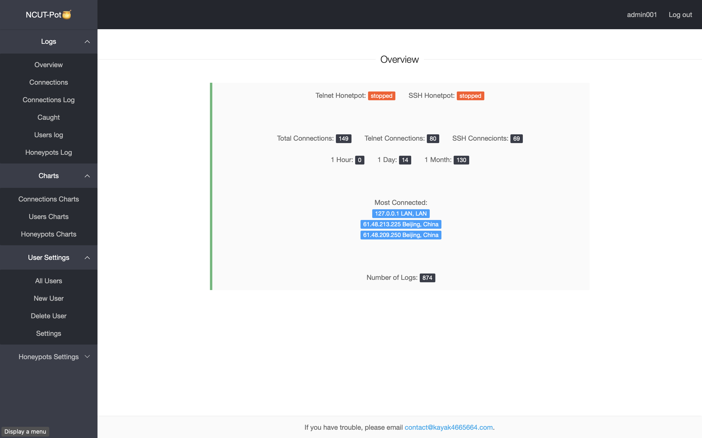
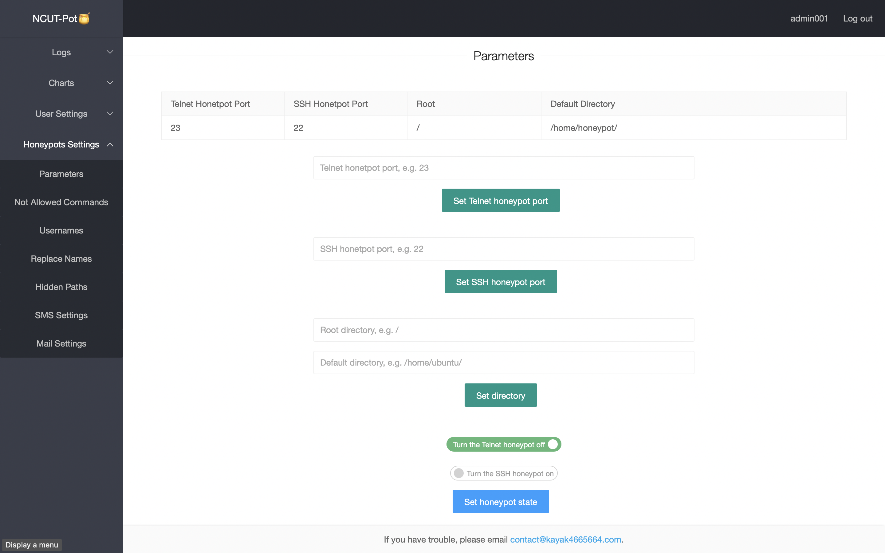
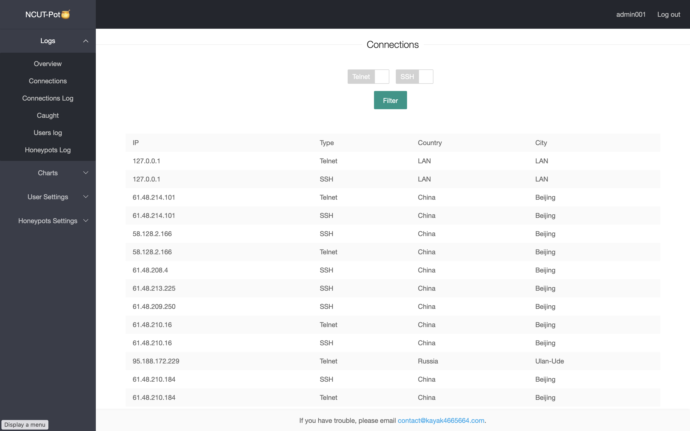
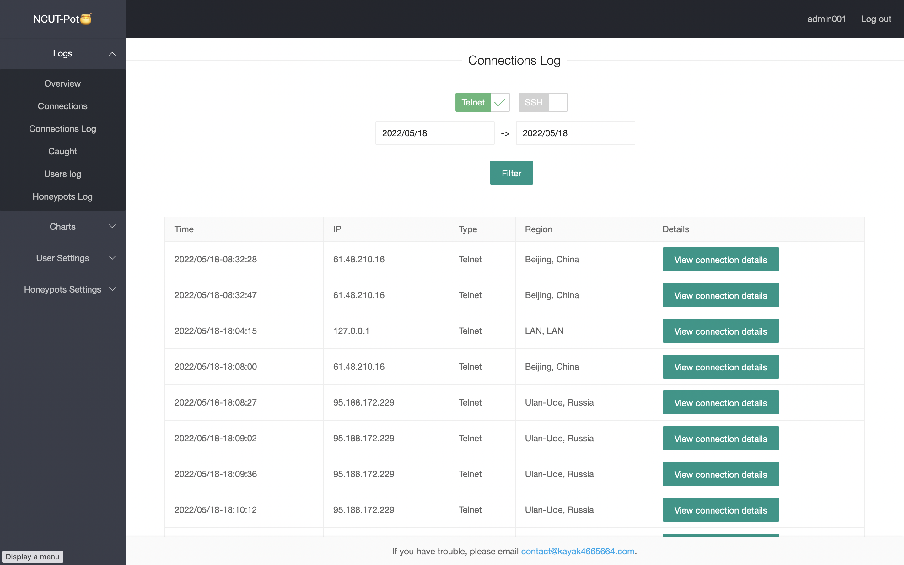
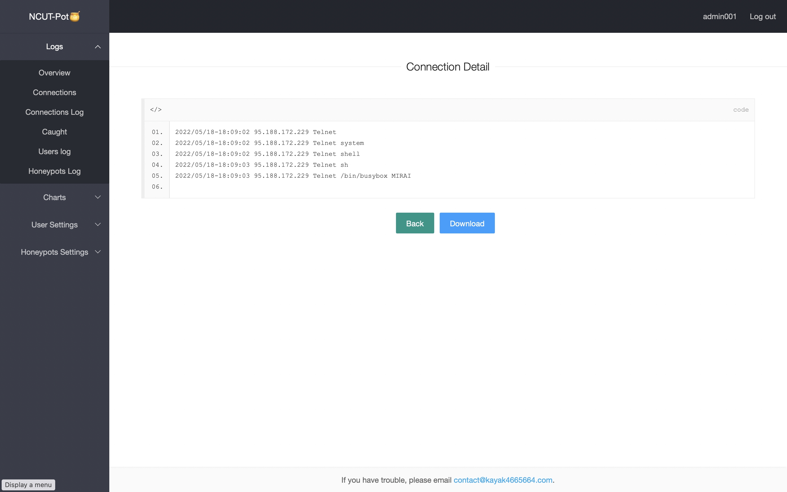
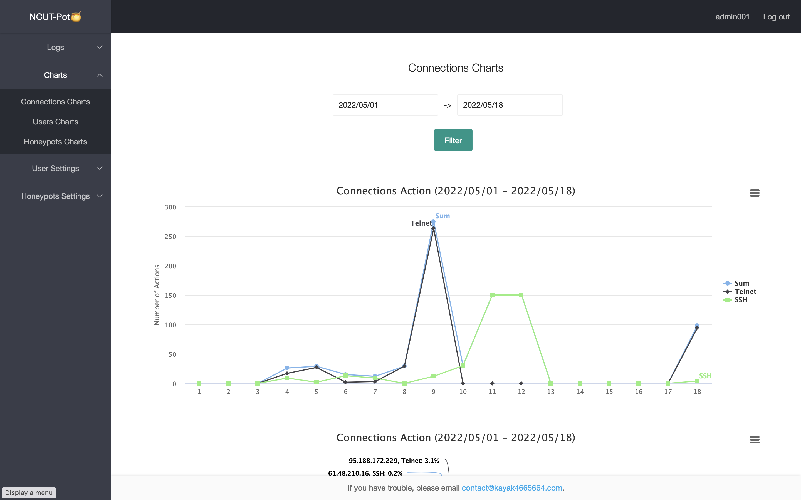
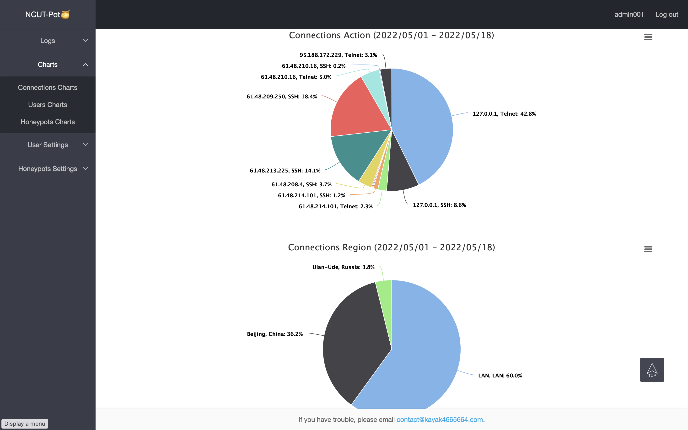

# FF-Pot

This honeypot supports Telnet and SSH two protocols, simulates the Linux system, and stores the data in the SQL database. In addition, it also sends alerts to users via SMS and email. Users can customize commands and directories.
这个蜜罐支持Telnet和SSH两种协议，模拟Linux系统，将攻击数据存储在SQL数据库中。此外，它还通过短信和电子邮件向用户发送警报。用户可以自定义蜜罐的命令和目录。

- The implementation of Telnet and SSH protocols is based on [telnetsrvlib](https://github.com/ianepperson/telnetsrvlib). Telnet和SSH协议的实现基于[telnetsrvlib](https://github.com/ianepperson/telnetsrvlib)。
- This is a Django project. 一个Django项目。
- admin001: 12345

## Tree
```
├── LICENSE
├── FF_Pot
│   ├── __init__.py
│   ├── asgi.py
│   ├── database.py
│   ├── funcs.py
│   ├── honeypot_server
│   │   ├── alert.py
│   │   ├── command_execution.py
│   │   ├── command_parser.py
│   │   ├── fake_files.py
│   │   ├── honeypot_manager.py
│   │   ├── send_mail.py
│   │   ├── send_sms.py
│   │   ├── ssh_handler.py
│   │   ├── ssh_honeypot.py
│   │   ├── state_of_honeypots.json
│   │   ├── state_of_honeypots.py
│   │   ├── telnet_handler.py
│   │   ├── telnet_honeypot.py
│   │   ├── telnet_server_library.py
│   │   └── temporary_files
│   ├── settings.py
│   ├── urls.py
│   ├── views.py
│   └── wsgi.py
├── FF_Pot_Model
│   ├── __init__.py
│   ├── admin.py
│   ├── apps.py
│   ├── migrations
│   │   └── __init__.py
│   ├── models.py
│   ├── tests.py
│   └── views.py
├── README.md
├── db.sqlite3
├── manage.py
├── statics
│   ├── Highcharts
│   │   └── code
│   │       ├── highcharts.js
│   │       └── modules
│   │           ├── accessibility.js
│   │           ├── data.js
│   │           ├── drilldown.js
│   │           ├── export-data.js
│   │           ├── exporting.js
│   │           └── series-label.js
│   ├── css
│   │   ├── layui.css
│   │   └── modules
│   │       ├── code.css
│   │       ├── laydate
│   │       │   └── default
│   │       │       └── laydate.css
│   │       └── layer
│   │           └── default
│   │               ├── icon-ext.png
│   │               ├── icon.png
│   │               ├── layer.css
│   │               ├── loading-0.gif
│   │               ├── loading-1.gif
│   │               └── loading-2.gif
│   ├── font
│   │   ├── iconfont.eot
│   │   ├── iconfont.svg
│   │   ├── iconfont.ttf
│   │   ├── iconfont.woff
│   │   └── iconfont.woff2
│   ├── jquery-3.6.0.min.js
│   └── layui.js
└── templates
    ├── all_users.html
    ├── caught.html
    ├── connection_log_details.html
    ├── connections.html
    ├── connections_charts.html
    ├── connections_log.html
    ├── delete_user.html
    ├── error.html
    ├── hidden_paths.html
    ├── home.html
    ├── home_with_charts.html
    ├── home_with_date_picker.html
    ├── home_with_upload_file.html
    ├── honeypots_charts.html
    ├── honeypots_log.html
    ├── login.html
    ├── mail_settings.html
    ├── new_user.html
    ├── not_allowed_commands.html
    ├── overview.html
    ├── parameters.html
    ├── replace_names.html
    ├── sms_settings.html
    ├── user_settings.html
    ├── usernames.html
    ├── users_charts.html
    └── users_log.html
```

## Example











